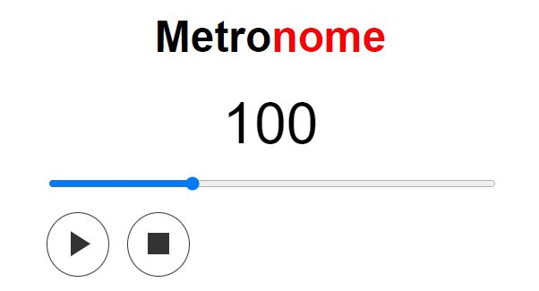

# metronome

It's a simple metronome built with HTML5/JavaScript.

_Even the sound effect was created by me :)_

You can access the metronome [here](https://lesnock.github.io/metronome/index.html)!

Enjoy!
